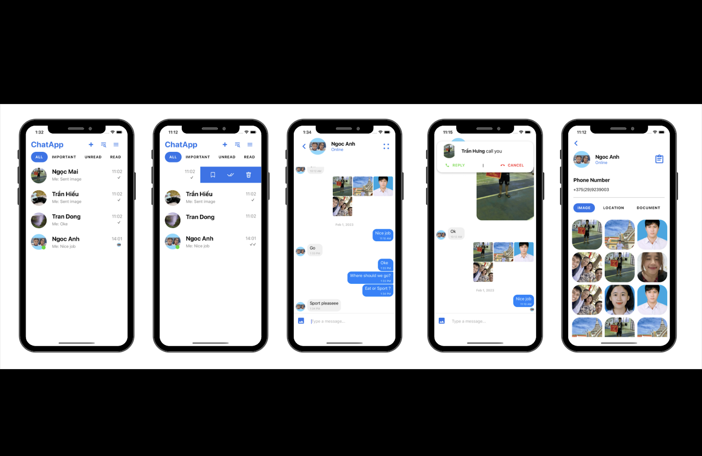

# Real-time-chat

 <h1 align="center">(React Native) Real time chat application</h1>

## Introduction

**Here is my React Native source code for real-time messaging application capable of private messaging, video-calling, login with Facebook.**

    

        

              
        
    
    
    

## Features

- Login with Facebook Using OAuth2 Authentication
- Private (1-1) Conversation Using Socket-io and react-native-gifted-chat
- Video Call Using react-native-webRTC
- Rich Media Attachments (Images)
- Typing Indicators
- Text, Media and Custom messages
- Send, Received, Seen status message
- Online Presence Indicators
- Message History
- List Images History
- Modal View Image
- Groups List

# Installation
1. Simply clone the project from this project.
2. Run "npm install" or "yarn" to install node_modules.
3. Run "npm start" then "npm run ios" for IOS simulator or "npm run android" for Android emulator.
 

